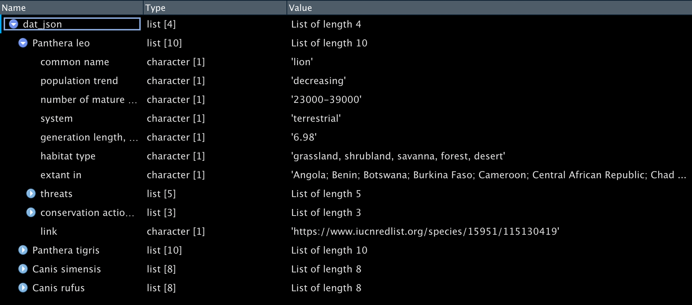

# Importing data from different file formats into R {#file-formats}

- Freda Wan (November 4, 2021)

&thinsp;  
<style type="text/css">
 .table {
    width: 80%;
}
</style>

This tutorial covers basic functions to import data from different formats and access them as tibbles. 

## At a glance

File type        Extension           package::function
----------     -------------     ----------------------------
   CSV            .csv           [readr::read_csv()](#ref-csv)
  Excel        .xls or .xlsx     [readxl:read_excel()](#ref-xls)
Plain text        .txt           [readr::read_lines()](#ref-txt)
  SPSS            .sav           [haven::read_sav()](#ref-spss)
Binary R data     .rds           [readr::read_rds()](#ref-rds)
   JSON          .json           [jsonlite::fromJSON()](#ref-json)

&thinsp;  

## 1. CSV{#ref-csv}

Most will be familiar with importing common-separated values (CSV) files using the `read_csv()` function offered in Tidyverse's 'readr' package. But what if your data is separated by tabs, semicolons, or other characters such as "|"? It is helpful to know that similar functions in 'readr' can readily help you import your data into R. 

- For tab-separated files (.tsv), use `read_tsv()`.  
- For semicolon-separated files, where the comma is the decimal point not the separator, use `read_csv2()`.  

Here is the syntax. 


```r
#library(tidyverse)
tbl_csv <- read_csv("data/filename.csv")
tbl_csv2 <- read_csv2("data/filename.csv")
tbl_tsv <- read_tsv("data/filename.tsv")
```

### Other delimiters  

If your data are delimited by other characters such as "|", use `read_delim()` and specify the delimiter.  

For example, if the text file looks like the dummy data below, we can see that "|" is the delimiter. (To try out the code below, you can copy the text, save it to a file and name it `delim_data.txt`.) 
```
ParticipantID|Condition1|Condition2|Condition3|Control
130059284|0.4|0.01|0.2|0
290100722|0.3|0.02|0.3|1
387005398|0.5|0.01|0.4|0
```


```r
dat_delim <- read_delim("data/delim_data.txt", delim = "|")  
```

```
## Rows: 3 Columns: 5
```

```
## ── Column specification ─────────────────────────────────────────────────────────
## Delimiter: "|"
## dbl (5): ParticipantID, Condition1, Condition2, Condition3, Control
```

```
## 
## ℹ Use `spec()` to retrieve the full column specification for this data.
## ℹ Specify the column types or set `show_col_types = FALSE` to quiet this message.
```
R is now able to read the data as a tibble: 
<table class="table table-striped" style="margin-left: auto; margin-right: auto;">
 <thead>
  <tr>
   <th style="text-align:center;"> ParticipantID </th>
   <th style="text-align:center;"> Condition1 </th>
   <th style="text-align:center;"> Condition2 </th>
   <th style="text-align:center;"> Condition3 </th>
   <th style="text-align:center;"> Control </th>
  </tr>
 </thead>
<tbody>
  <tr>
   <td style="text-align:center;"> 130059284 </td>
   <td style="text-align:center;"> 0.4 </td>
   <td style="text-align:center;"> 0.01 </td>
   <td style="text-align:center;"> 0.2 </td>
   <td style="text-align:center;"> 0 </td>
  </tr>
  <tr>
   <td style="text-align:center;"> 290100722 </td>
   <td style="text-align:center;"> 0.3 </td>
   <td style="text-align:center;"> 0.02 </td>
   <td style="text-align:center;"> 0.3 </td>
   <td style="text-align:center;"> 1 </td>
  </tr>
  <tr>
   <td style="text-align:center;"> 387005398 </td>
   <td style="text-align:center;"> 0.5 </td>
   <td style="text-align:center;"> 0.01 </td>
   <td style="text-align:center;"> 0.4 </td>
   <td style="text-align:center;"> 0 </td>
  </tr>
</tbody>
</table>

### Changing the data type for each column

Sometimes we want to specify the data type for each column. When we load the data, R generates a message (as above) to indicate the data type of each column. In our case, R has recognised all 5 columns as doubles or `dbl`, which is a class of numeric data, similar to float in other programming languages.  

Let's say we want `ParticipantID` as characters and `Control` as boolean (i.e., TRUE or FALSE, known as logical in R), we can add the `col_types` argument. 

In the code below, `col_types = "c???l"` specifies that for our 5 columns, we want to change the data type of `ParticipantID` to character and `Control` to logical. Since we don't need to change the data type for Condition1, Condition2, and Condition3, we use `?` to allow R to guess.


```r
dat_delim_col_types <- read_delim("data/delim_data.txt", delim = "|", col_types = "c???l")  
spec(dat_delim_col_types) # check column data types
```

```
## cols(
##   ParticipantID = col_character(),
##   Condition1 = col_double(),
##   Condition2 = col_double(),
##   Condition3 = col_double(),
##   Control = col_logical()
## )
```
You can specify the data type you want by using one character to represent each column. The column types are: `c = character, i = integer, n = number, d = double, l = logical, f = factor, D = date, T = date time, t = time,` `? = guess, or _/- to skip the column`.  

The argument `col_types` is also used in other functions in this tutorial, including `read_excel()` for Excel data and `read_table()` for reading text as a tibble.  

### Write data to CSV

After loading data from various file formats and having cleaned and wrangled the data, you may want to save the tibble to .csv. This would allow you to view the data later or share the file with others without having to run the whole R script again.  

Here is the syntax. 

`write_csv(cleaned_data, "cleaned_data.csv")`

Read more about 'readr' package and see the [cheat sheet here](https://github.com/rstudio/cheatsheets/blob/master/data-import.pdf). Related packages include 'readxl' (detailed below) and 'googlesheets4' which allows you to read data from and write data to Google Sheets.  

&nbsp;  

## 2. Excel (.xls or .xlsx){#ref-xls}  

We use the 'readxl' package, part of Tidyverse, to read Excel data into R. Try out the 'readxl' functions below either using your data or download the [Demo.xlsx file here](data/Demo.xlsx) (111KB). The data have been adapted from a public domain dataset, Chocolate Bar Ratings ([Tatman, 2017](#ref-choc)), which contains expert ratings of 1700 chocolate bars.    

For demonstration purposes, the demo file contains 3 sheets, sorted by chocolate makers' company names starting A to G (Sheet 1), H to Q (Sheet 2), and R to Z (Sheet 3). You can access sheets either by name or by index. 


```r
# Suggested: install 'readxl' and load separately
library(readxl) 
dat_excel<- readxl::read_excel("data/Demo.xlsx") # by default, this loads Sheet 1 only. 
```
<table class="table table-striped" style="margin-left: auto; margin-right: auto;">
 <thead>
  <tr>
   <th style="text-align:center;"> Company
(Maker-if known) </th>
   <th style="text-align:center;"> Specific Bean Origin
or Bar Name </th>
   <th style="text-align:center;"> REF </th>
   <th style="text-align:center;"> Review
Date </th>
   <th style="text-align:center;"> Cocoa
Percent </th>
   <th style="text-align:center;"> Company
Location </th>
   <th style="text-align:center;"> Rating </th>
   <th style="text-align:center;"> Bean
Type </th>
   <th style="text-align:center;"> Broad Bean
Origin </th>
  </tr>
 </thead>
<tbody>
  <tr>
   <td style="text-align:center;"> A. Morin </td>
   <td style="text-align:center;"> Agua Grande </td>
   <td style="text-align:center;"> 1876 </td>
   <td style="text-align:center;"> 2016 </td>
   <td style="text-align:center;"> 0.63 </td>
   <td style="text-align:center;"> France </td>
   <td style="text-align:center;"> 3.75 </td>
   <td style="text-align:center;">   </td>
   <td style="text-align:center;"> Sao Tome </td>
  </tr>
  <tr>
   <td style="text-align:center;"> A. Morin </td>
   <td style="text-align:center;"> Kpime </td>
   <td style="text-align:center;"> 1676 </td>
   <td style="text-align:center;"> 2015 </td>
   <td style="text-align:center;"> 0.70 </td>
   <td style="text-align:center;"> France </td>
   <td style="text-align:center;"> 2.75 </td>
   <td style="text-align:center;">   </td>
   <td style="text-align:center;"> Togo </td>
  </tr>
  <tr>
   <td style="text-align:center;"> A. Morin </td>
   <td style="text-align:center;"> Atsane </td>
   <td style="text-align:center;"> 1676 </td>
   <td style="text-align:center;"> 2015 </td>
   <td style="text-align:center;"> 0.70 </td>
   <td style="text-align:center;"> France </td>
   <td style="text-align:center;"> 3.00 </td>
   <td style="text-align:center;">   </td>
   <td style="text-align:center;"> Togo </td>
  </tr>
  <tr>
   <td style="text-align:center;"> A. Morin </td>
   <td style="text-align:center;"> Akata </td>
   <td style="text-align:center;"> 1680 </td>
   <td style="text-align:center;"> 2015 </td>
   <td style="text-align:center;"> 0.70 </td>
   <td style="text-align:center;"> France </td>
   <td style="text-align:center;"> 3.50 </td>
   <td style="text-align:center;">   </td>
   <td style="text-align:center;"> Togo </td>
  </tr>
  <tr>
   <td style="text-align:center;"> A. Morin </td>
   <td style="text-align:center;"> Quilla </td>
   <td style="text-align:center;"> 1704 </td>
   <td style="text-align:center;"> 2015 </td>
   <td style="text-align:center;"> 0.70 </td>
   <td style="text-align:center;"> France </td>
   <td style="text-align:center;"> 3.50 </td>
   <td style="text-align:center;">   </td>
   <td style="text-align:center;"> Peru </td>
  </tr>
  <tr>
   <td style="text-align:center;"> A. Morin </td>
   <td style="text-align:center;"> Carenero </td>
   <td style="text-align:center;"> 1315 </td>
   <td style="text-align:center;"> 2014 </td>
   <td style="text-align:center;"> 0.70 </td>
   <td style="text-align:center;"> France </td>
   <td style="text-align:center;"> 2.75 </td>
   <td style="text-align:center;"> Criollo </td>
   <td style="text-align:center;"> Venezuela </td>
  </tr>
</tbody>
</table>
If you check `dat_excel` (using either `summary()` from base R or `dplyr::glimpse()`), you will see that if you don't specify the sheet, only the first sheet is loaded. 

Use the 'readr' function `excel_sheets()` to get a list of sheet names. 

```r
excel_sheets("data/Demo.xlsx")
```

```
## [1] "Companies_A_to_G" "Companies_H_to_Q" "Companies_R_to_Z"
```

Then, you can specify which sheet you want to load, by sheet name or index. 

```r
sheet_by_name <- read_excel("data/Demo.xlsx", sheet = "Companies_H_to_Q") #load sheet 2 by name
sheet_by_index <- read_excel("data/Demo.xlsx", sheet = 3) #load sheet by index
```

### Dealing with formulas and formatted cells

Sometimes you may encounter Excel data that contain formulas written in VBA macros or highlighted cells in yellow or in bold. 

If you want to extract the formulas or formatted cells from Excel, there are R functions that could help. The 'tidyxl' package has the function `tidyxl::xlsx_cells()` which reads the property of each cell in an Excel spreadsheet, such as the data type, formatting, whether it is a formula, the cell's font, height and width. Please refer to the ['tidyxl' vignette](https://cran.r-project.org/web/packages/tidyxl/vignettes/tidyxl.html). 

However, proceed with caution! Spreadsheet errors, either due to human mistakes or Excel's autocorrect functions, have raised reproducibility concerns in behavioural science and genetics research (see [Alexander, 2013](#ref-alexander); [Lewis, 2021](#ref-lewis)). If you see strange behaviour from your Excel data, check the file: Are the formulas referring to the correct cells? Has a large number been autocorrected into a date? When in doubt, open the file in Excel to check.  

&nbsp;  

## 3. Plain text (.txt){#ref-txt}

When your data are in .txt files, you can either use readLines() from base or readr::read_lines() from Tidyverse. Here, we use the latter, as it runs faster for large datasets.  

As an example, we use a simple dataset from [Stigliani and Grill-Spector (2018)](#ref-stigliani), a neuroscience study. You can [click here](https://osf.io/vzy8h/download) to download the data directly (392 bytes).  

First, we read in the file to see what it contains. 


```r
#load the tidyverse package
readr_text <- read_lines(("data/Exp1_Run1.txt"), n_max=10)
readr_text
```

```
##  [1] "Exp1 conditions: 2s, 4s, 8s, 15s, 30s"
##  [2] "Run duration (s): 276"                
##  [3] ""                                     
##  [4] "Trial Condition Onset Duration Image" 
##  [5] "1 8s 12 8 scrambled-260.jpg"          
##  [6] "2 2s 32 2 scrambled-191.jpg"          
##  [7] "3 4s 46 4 scrambled-481.jpg"          
##  [8] "4 30s 75 30 scrambled-996.jpg"        
##  [9] "5 15s 117 15 scrambled-355.jpg"       
## [10] "6 8s 144 8 scrambled-47.jpg"
```
The `n_max` argument above specifies how many lines of data you would like to read. We can see that we need to skip the first 3 lines for the data to form a tibble. We use `read_table()` to create the tibble. 


```r
dat_txt <- read_table(file = "data/Exp1_Run1.txt", skip = 3) # skip first 3 lines
```
<table class="table table-striped" style="margin-left: auto; margin-right: auto;">
 <thead>
  <tr>
   <th style="text-align:center;"> Trial </th>
   <th style="text-align:center;"> Condition </th>
   <th style="text-align:center;"> Onset </th>
   <th style="text-align:center;"> Duration </th>
   <th style="text-align:center;"> Image </th>
  </tr>
 </thead>
<tbody>
  <tr>
   <td style="text-align:center;"> 1 </td>
   <td style="text-align:center;"> 8s </td>
   <td style="text-align:center;"> 12 </td>
   <td style="text-align:center;"> 8 </td>
   <td style="text-align:center;"> scrambled-260.jpg </td>
  </tr>
  <tr>
   <td style="text-align:center;"> 2 </td>
   <td style="text-align:center;"> 2s </td>
   <td style="text-align:center;"> 32 </td>
   <td style="text-align:center;"> 2 </td>
   <td style="text-align:center;"> scrambled-191.jpg </td>
  </tr>
  <tr>
   <td style="text-align:center;"> 3 </td>
   <td style="text-align:center;"> 4s </td>
   <td style="text-align:center;"> 46 </td>
   <td style="text-align:center;"> 4 </td>
   <td style="text-align:center;"> scrambled-481.jpg </td>
  </tr>
  <tr>
   <td style="text-align:center;"> 4 </td>
   <td style="text-align:center;"> 30s </td>
   <td style="text-align:center;"> 75 </td>
   <td style="text-align:center;"> 30 </td>
   <td style="text-align:center;"> scrambled-996.jpg </td>
  </tr>
  <tr>
   <td style="text-align:center;"> 5 </td>
   <td style="text-align:center;"> 15s </td>
   <td style="text-align:center;"> 117 </td>
   <td style="text-align:center;"> 15 </td>
   <td style="text-align:center;"> scrambled-355.jpg </td>
  </tr>
  <tr>
   <td style="text-align:center;"> 6 </td>
   <td style="text-align:center;"> 8s </td>
   <td style="text-align:center;"> 144 </td>
   <td style="text-align:center;"> 8 </td>
   <td style="text-align:center;"> scrambled-47.jpg </td>
  </tr>
  <tr>
   <td style="text-align:center;"> 7 </td>
   <td style="text-align:center;"> 15s </td>
   <td style="text-align:center;"> 177 </td>
   <td style="text-align:center;"> 15 </td>
   <td style="text-align:center;"> scrambled-520.jpg </td>
  </tr>
  <tr>
   <td style="text-align:center;"> 8 </td>
   <td style="text-align:center;"> 2s </td>
   <td style="text-align:center;"> 204 </td>
   <td style="text-align:center;"> 2 </td>
   <td style="text-align:center;"> scrambled-512.jpg </td>
  </tr>
  <tr>
   <td style="text-align:center;"> 9 </td>
   <td style="text-align:center;"> 4s </td>
   <td style="text-align:center;"> 218 </td>
   <td style="text-align:center;"> 4 </td>
   <td style="text-align:center;"> scrambled-262.jpg </td>
  </tr>
  <tr>
   <td style="text-align:center;"> 10 </td>
   <td style="text-align:center;"> 30s </td>
   <td style="text-align:center;"> 234 </td>
   <td style="text-align:center;"> 30 </td>
   <td style="text-align:center;"> scrambled-201.jpg </td>
  </tr>
</tbody>
</table>
By default, the argument `col_names` is set to TRUE, so that the first row of text input will be imported as column names. If you set it to FALSE, the column names will be generated automatically as X1, X2, X3, etc. 

If you want to rename columns in the same line of code, you can enter a character vector for `col_names`. For example: 

```r
dat_txt_new_column_names <- read_table(file = "data/Exp1_Run1.txt", skip = 4, col_names = c("Trial_new", "Condition_new", "Onset_new", "Duration_new", "Image_new"))
#since we are renaming the columns, we skip 4 lines
```
The column names will become: 
<table class="table table-striped" style="margin-left: auto; margin-right: auto;">
 <thead>
  <tr>
   <th style="text-align:center;"> Trial_new </th>
   <th style="text-align:center;"> Condition_new </th>
   <th style="text-align:center;"> Onset_new </th>
   <th style="text-align:center;"> Duration_new </th>
   <th style="text-align:center;"> Image_new </th>
  </tr>
 </thead>
<tbody>
  <tr>
   <td style="text-align:center;"> 1 </td>
   <td style="text-align:center;"> 8s </td>
   <td style="text-align:center;"> 12 </td>
   <td style="text-align:center;"> 8 </td>
   <td style="text-align:center;"> scrambled-260.jpg </td>
  </tr>
</tbody>
</table>
Of course, another way to rename columns would be using `dplyr::rename(data, new_name = old_column_name)` or `dplyr::rename_with(data, function)`. For example, running the following will turn all column names to upper case. Try it yourself and see. 

```r
dat_txt_upper <- rename_with(dat_txt, toupper)
```

&nbsp;  

## 4. SPSS data (.sav){#ref-spss}

We will use the 'haven' package, which is part of Tidyverse, to import SPSS data into a tibble.  

The example below uses SPSS data from [Norman et al.(2021)](#ref-norman), Study 2, which examines adult identity. You can [click here](https://osf.io/a6hxy/download) to download the data directly (564KB).  


```r
# Suggested: install the package 'haven' and load it in addition to Tidyverse. 
library(haven)
dat_sav <- haven::read_sav("data/EA Across Age Data.sav")
```
The tibble `dat_sav` has 173 columns and 658 rows. If you only need to load a subset of columns, the `col_select` argument allows you to select columns by index or by column name. Below is an example of using `col_select` and what the output looks like. This would be an alternative to `dplyr::select()`.  

```r
#load the first 8 columns
dat_select_by_index <- read_sav("data/EA Across Age Data.sav", col_select=(1:8))
```
<table class="table table-striped" style="margin-left: auto; margin-right: auto;">
 <thead>
  <tr>
   <th style="text-align:center;"> StartDate </th>
   <th style="text-align:center;"> EndDate </th>
   <th style="text-align:center;"> Progress </th>
   <th style="text-align:center;"> Duration__in_seconds_ </th>
   <th style="text-align:center;"> IC </th>
   <th style="text-align:center;"> IDEA_1_1 </th>
   <th style="text-align:center;"> IDEA_1_2 </th>
   <th style="text-align:center;"> IDEA_1_3 </th>
  </tr>
 </thead>
<tbody>
  <tr>
   <td style="text-align:center;"> 2019-10-02 18:00:53 </td>
   <td style="text-align:center;"> 2019-10-02 18:12:17 </td>
   <td style="text-align:center;"> 100 </td>
   <td style="text-align:center;"> 684 </td>
   <td style="text-align:center;"> 1 </td>
   <td style="text-align:center;"> 3 </td>
   <td style="text-align:center;"> 4 </td>
   <td style="text-align:center;"> 2 </td>
  </tr>
  <tr>
   <td style="text-align:center;"> 2019-10-12 13:18:40 </td>
   <td style="text-align:center;"> 2019-10-12 13:30:16 </td>
   <td style="text-align:center;"> 100 </td>
   <td style="text-align:center;"> 696 </td>
   <td style="text-align:center;"> 1 </td>
   <td style="text-align:center;"> 3 </td>
   <td style="text-align:center;"> 4 </td>
   <td style="text-align:center;"> 3 </td>
  </tr>
  <tr>
   <td style="text-align:center;"> 2019-10-12 15:03:10 </td>
   <td style="text-align:center;"> 2019-10-12 15:12:03 </td>
   <td style="text-align:center;"> 100 </td>
   <td style="text-align:center;"> 533 </td>
   <td style="text-align:center;"> 1 </td>
   <td style="text-align:center;"> 3 </td>
   <td style="text-align:center;"> 4 </td>
   <td style="text-align:center;"> 3 </td>
  </tr>
  <tr>
   <td style="text-align:center;"> 2019-10-12 15:02:12 </td>
   <td style="text-align:center;"> 2019-10-12 15:12:55 </td>
   <td style="text-align:center;"> 100 </td>
   <td style="text-align:center;"> 642 </td>
   <td style="text-align:center;"> 1 </td>
   <td style="text-align:center;"> 3 </td>
   <td style="text-align:center;"> 4 </td>
   <td style="text-align:center;"> 4 </td>
  </tr>
  <tr>
   <td style="text-align:center;"> 2019-10-12 15:22:10 </td>
   <td style="text-align:center;"> 2019-10-12 15:37:06 </td>
   <td style="text-align:center;"> 100 </td>
   <td style="text-align:center;"> 895 </td>
   <td style="text-align:center;"> 1 </td>
   <td style="text-align:center;"> 4 </td>
   <td style="text-align:center;"> 4 </td>
   <td style="text-align:center;"> 4 </td>
  </tr>
  <tr>
   <td style="text-align:center;"> 2019-10-12 15:43:36 </td>
   <td style="text-align:center;"> 2019-10-12 15:53:44 </td>
   <td style="text-align:center;"> 100 </td>
   <td style="text-align:center;"> 608 </td>
   <td style="text-align:center;"> 1 </td>
   <td style="text-align:center;"> 4 </td>
   <td style="text-align:center;"> 3 </td>
   <td style="text-align:center;"> 4 </td>
  </tr>
</tbody>
</table>
&thinsp;  

```r
#load columns with name starting with "IDEA"
dat_select_by_colname <- read_sav("data/EA Across Age Data.sav", 
                                  col_select = starts_with("IDEA"))
```
<div style="border: 1px solid #ddd; padding: 5px; overflow-x: scroll; width:99%; "><table class="table table-striped" style="margin-left: auto; margin-right: auto;">
 <thead>
  <tr>
   <th style="text-align:center;"> IDEA_1_1 </th>
   <th style="text-align:center;"> IDEA_1_2 </th>
   <th style="text-align:center;"> IDEA_1_3 </th>
   <th style="text-align:center;"> IDEA_1_4 </th>
   <th style="text-align:center;"> IDEA_1_5 </th>
   <th style="text-align:center;"> IDEA_1_6 </th>
   <th style="text-align:center;"> IDEA_1_7 </th>
   <th style="text-align:center;"> IDEA_1_8 </th>
   <th style="text-align:center;"> IDEA_1_9 </th>
   <th style="text-align:center;"> IDEA_1_10 </th>
   <th style="text-align:center;"> IDEA_1_11 </th>
   <th style="text-align:center;"> IDEA_1_12 </th>
   <th style="text-align:center;"> IDEA_1_13 </th>
   <th style="text-align:center;"> IDEA_1_14 </th>
   <th style="text-align:center;"> IDEA_1_15 </th>
   <th style="text-align:center;"> IDEA_2_1 </th>
   <th style="text-align:center;"> IDEA_2_2 </th>
   <th style="text-align:center;"> IDEA_2_3 </th>
   <th style="text-align:center;"> IDEA_2_4 </th>
   <th style="text-align:center;"> IDEA_2_5 </th>
   <th style="text-align:center;"> IDEA_2_6 </th>
   <th style="text-align:center;"> IDEA_2_7 </th>
   <th style="text-align:center;"> IDEA_2_8 </th>
   <th style="text-align:center;"> IDEA_2_9 </th>
   <th style="text-align:center;"> IDEA_2_10 </th>
   <th style="text-align:center;"> IDEA_2_11 </th>
   <th style="text-align:center;"> IDEA_2_12 </th>
   <th style="text-align:center;"> IDEA_2_13 </th>
   <th style="text-align:center;"> IDEA_2_14 </th>
   <th style="text-align:center;"> IDEA_2_15 </th>
   <th style="text-align:center;"> IDEA_2_16 </th>
   <th style="text-align:center;"> IDEA_Total </th>
  </tr>
 </thead>
<tbody>
  <tr>
   <td style="text-align:center;"> 3 </td>
   <td style="text-align:center;"> 4 </td>
   <td style="text-align:center;"> 2 </td>
   <td style="text-align:center;"> 4 </td>
   <td style="text-align:center;"> 3 </td>
   <td style="text-align:center;"> 3 </td>
   <td style="text-align:center;"> 4 </td>
   <td style="text-align:center;"> 4 </td>
   <td style="text-align:center;"> 4 </td>
   <td style="text-align:center;"> 3 </td>
   <td style="text-align:center;"> 4 </td>
   <td style="text-align:center;"> 4 </td>
   <td style="text-align:center;"> 2 </td>
   <td style="text-align:center;"> 2 </td>
   <td style="text-align:center;"> 3 </td>
   <td style="text-align:center;"> 3 </td>
   <td style="text-align:center;"> 3 </td>
   <td style="text-align:center;"> 3 </td>
   <td style="text-align:center;"> 4 </td>
   <td style="text-align:center;"> 4 </td>
   <td style="text-align:center;"> 4 </td>
   <td style="text-align:center;"> 4 </td>
   <td style="text-align:center;"> 4 </td>
   <td style="text-align:center;"> 4 </td>
   <td style="text-align:center;"> 4 </td>
   <td style="text-align:center;"> 3 </td>
   <td style="text-align:center;"> 4 </td>
   <td style="text-align:center;"> 4 </td>
   <td style="text-align:center;"> 4 </td>
   <td style="text-align:center;"> 3 </td>
   <td style="text-align:center;"> 2 </td>
   <td style="text-align:center;"> 3.419355 </td>
  </tr>
  <tr>
   <td style="text-align:center;"> 3 </td>
   <td style="text-align:center;"> 4 </td>
   <td style="text-align:center;"> 3 </td>
   <td style="text-align:center;"> 3 </td>
   <td style="text-align:center;"> 3 </td>
   <td style="text-align:center;"> 3 </td>
   <td style="text-align:center;"> 4 </td>
   <td style="text-align:center;"> 4 </td>
   <td style="text-align:center;"> 3 </td>
   <td style="text-align:center;"> 3 </td>
   <td style="text-align:center;"> 4 </td>
   <td style="text-align:center;"> 3 </td>
   <td style="text-align:center;"> 2 </td>
   <td style="text-align:center;"> 3 </td>
   <td style="text-align:center;"> 3 </td>
   <td style="text-align:center;"> 3 </td>
   <td style="text-align:center;"> 4 </td>
   <td style="text-align:center;"> 3 </td>
   <td style="text-align:center;"> 3 </td>
   <td style="text-align:center;"> 3 </td>
   <td style="text-align:center;"> 3 </td>
   <td style="text-align:center;"> 3 </td>
   <td style="text-align:center;"> 4 </td>
   <td style="text-align:center;"> 3 </td>
   <td style="text-align:center;"> 4 </td>
   <td style="text-align:center;"> 4 </td>
   <td style="text-align:center;"> 4 </td>
   <td style="text-align:center;"> 4 </td>
   <td style="text-align:center;"> 3 </td>
   <td style="text-align:center;"> 2 </td>
   <td style="text-align:center;"> 2 </td>
   <td style="text-align:center;"> 3.225807 </td>
  </tr>
  <tr>
   <td style="text-align:center;"> 3 </td>
   <td style="text-align:center;"> 4 </td>
   <td style="text-align:center;"> 3 </td>
   <td style="text-align:center;"> 3 </td>
   <td style="text-align:center;"> 4 </td>
   <td style="text-align:center;"> 3 </td>
   <td style="text-align:center;"> 4 </td>
   <td style="text-align:center;"> 4 </td>
   <td style="text-align:center;"> 4 </td>
   <td style="text-align:center;"> 3 </td>
   <td style="text-align:center;"> 4 </td>
   <td style="text-align:center;"> 4 </td>
   <td style="text-align:center;"> 2 </td>
   <td style="text-align:center;"> 3 </td>
   <td style="text-align:center;"> 4 </td>
   <td style="text-align:center;"> 4 </td>
   <td style="text-align:center;"> 4 </td>
   <td style="text-align:center;"> 3 </td>
   <td style="text-align:center;"> 3 </td>
   <td style="text-align:center;"> 4 </td>
   <td style="text-align:center;"> 4 </td>
   <td style="text-align:center;"> 4 </td>
   <td style="text-align:center;"> 4 </td>
   <td style="text-align:center;"> 4 </td>
   <td style="text-align:center;"> 3 </td>
   <td style="text-align:center;"> 3 </td>
   <td style="text-align:center;"> 4 </td>
   <td style="text-align:center;"> 4 </td>
   <td style="text-align:center;"> 4 </td>
   <td style="text-align:center;"> 4 </td>
   <td style="text-align:center;"> 4 </td>
   <td style="text-align:center;"> 3.612903 </td>
  </tr>
  <tr>
   <td style="text-align:center;"> 3 </td>
   <td style="text-align:center;"> 4 </td>
   <td style="text-align:center;"> 4 </td>
   <td style="text-align:center;"> 4 </td>
   <td style="text-align:center;"> 3 </td>
   <td style="text-align:center;"> 2 </td>
   <td style="text-align:center;"> 4 </td>
   <td style="text-align:center;"> 4 </td>
   <td style="text-align:center;"> 4 </td>
   <td style="text-align:center;"> 2 </td>
   <td style="text-align:center;"> 4 </td>
   <td style="text-align:center;"> 4 </td>
   <td style="text-align:center;"> 1 </td>
   <td style="text-align:center;"> 3 </td>
   <td style="text-align:center;"> 4 </td>
   <td style="text-align:center;"> 3 </td>
   <td style="text-align:center;"> 4 </td>
   <td style="text-align:center;"> 3 </td>
   <td style="text-align:center;"> 4 </td>
   <td style="text-align:center;"> 4 </td>
   <td style="text-align:center;"> 3 </td>
   <td style="text-align:center;"> 3 </td>
   <td style="text-align:center;"> 3 </td>
   <td style="text-align:center;"> 3 </td>
   <td style="text-align:center;"> 2 </td>
   <td style="text-align:center;"> 4 </td>
   <td style="text-align:center;"> 4 </td>
   <td style="text-align:center;"> 4 </td>
   <td style="text-align:center;"> 4 </td>
   <td style="text-align:center;"> 4 </td>
   <td style="text-align:center;"> 4 </td>
   <td style="text-align:center;"> 3.419355 </td>
  </tr>
  <tr>
   <td style="text-align:center;"> 4 </td>
   <td style="text-align:center;"> 4 </td>
   <td style="text-align:center;"> 4 </td>
   <td style="text-align:center;"> 4 </td>
   <td style="text-align:center;"> 3 </td>
   <td style="text-align:center;"> 3 </td>
   <td style="text-align:center;"> 4 </td>
   <td style="text-align:center;"> 4 </td>
   <td style="text-align:center;"> 4 </td>
   <td style="text-align:center;"> 4 </td>
   <td style="text-align:center;"> 4 </td>
   <td style="text-align:center;"> 4 </td>
   <td style="text-align:center;"> 3 </td>
   <td style="text-align:center;"> 3 </td>
   <td style="text-align:center;"> 4 </td>
   <td style="text-align:center;"> 4 </td>
   <td style="text-align:center;"> 4 </td>
   <td style="text-align:center;"> 3 </td>
   <td style="text-align:center;"> 4 </td>
   <td style="text-align:center;"> 3 </td>
   <td style="text-align:center;"> 4 </td>
   <td style="text-align:center;"> 4 </td>
   <td style="text-align:center;"> 3 </td>
   <td style="text-align:center;"> 3 </td>
   <td style="text-align:center;"> 4 </td>
   <td style="text-align:center;"> 4 </td>
   <td style="text-align:center;"> 4 </td>
   <td style="text-align:center;"> 4 </td>
   <td style="text-align:center;"> 4 </td>
   <td style="text-align:center;"> 4 </td>
   <td style="text-align:center;"> 4 </td>
   <td style="text-align:center;"> 3.741935 </td>
  </tr>
  <tr>
   <td style="text-align:center;"> 4 </td>
   <td style="text-align:center;"> 3 </td>
   <td style="text-align:center;"> 4 </td>
   <td style="text-align:center;"> 3 </td>
   <td style="text-align:center;"> 3 </td>
   <td style="text-align:center;"> 3 </td>
   <td style="text-align:center;"> 4 </td>
   <td style="text-align:center;"> 4 </td>
   <td style="text-align:center;"> 4 </td>
   <td style="text-align:center;"> 3 </td>
   <td style="text-align:center;"> 4 </td>
   <td style="text-align:center;"> 4 </td>
   <td style="text-align:center;"> 1 </td>
   <td style="text-align:center;"> 2 </td>
   <td style="text-align:center;"> 3 </td>
   <td style="text-align:center;"> 3 </td>
   <td style="text-align:center;"> 4 </td>
   <td style="text-align:center;"> 2 </td>
   <td style="text-align:center;"> 2 </td>
   <td style="text-align:center;"> 3 </td>
   <td style="text-align:center;"> 4 </td>
   <td style="text-align:center;"> 3 </td>
   <td style="text-align:center;"> 4 </td>
   <td style="text-align:center;"> 2 </td>
   <td style="text-align:center;"> 3 </td>
   <td style="text-align:center;"> 2 </td>
   <td style="text-align:center;"> 4 </td>
   <td style="text-align:center;"> 4 </td>
   <td style="text-align:center;"> 4 </td>
   <td style="text-align:center;"> 2 </td>
   <td style="text-align:center;"> 3 </td>
   <td style="text-align:center;"> 3.161290 </td>
  </tr>
</tbody>
</table></div>

#### Related 
If you encounter .por files, which are ASCII text data files generated by SPSS, use the `haven::read_por()` function.  

The 'haven' package can also read Stata and SAS files into R. [Read more](https://haven.tidyverse.org)

&nbsp;  

## 5. Binary R data (.rds){#ref-rds}

RDS files store datasets in a compressed format to save storage space. Additionally, RDS preserves data types such as dates and factors, so we don't need to worry about redefining data types after reading the file into R. 

To read .rds files, use either `readRDS()` from baseR or `read_rds()` from Tidyverse's 'readr' package. We use Tidyverse in the example below. 

The example below uses data from [Lukavsky (2018)](#ref-lukavsky), Experiment 1. The study investigates participants' ability to recognise what they have seen in their central and peripheral vision. You can [click here](https://osf.io/dy5hv/download) to download the data directly (185KB). 


```r
#library(tidyverse)
dat_binary <- read_rds("data/exp1.rds") 
```
You will see that this dataset has over 5300 rows and 26 columns. Here is what the first 6 lines look like. 

<div style="border: 1px solid #ddd; padding: 5px; overflow-x: scroll; width:99%; "><table class="table table-striped" style="margin-left: auto; margin-right: auto;">
 <thead>
  <tr>
   <th style="text-align:center;"> id </th>
   <th style="text-align:center;"> version </th>
   <th style="text-align:center;"> block </th>
   <th style="text-align:center;"> trial </th>
   <th style="text-align:center;"> image </th>
   <th style="text-align:center;"> response </th>
   <th style="text-align:center;"> rt </th>
   <th style="text-align:center;"> fix_ok </th>
   <th style="text-align:center;"> new_sample </th>
   <th style="text-align:center;"> d </th>
   <th style="text-align:center;"> mx </th>
   <th style="text-align:center;"> my </th>
   <th style="text-align:center;"> extra_trials </th>
   <th style="text-align:center;"> sofa </th>
   <th style="text-align:center;"> focus </th>
   <th style="text-align:center;"> code_in </th>
   <th style="text-align:center;"> code_out </th>
   <th style="text-align:center;"> category_in </th>
   <th style="text-align:center;"> category_out </th>
   <th style="text-align:center;"> image_in </th>
   <th style="text-align:center;"> image_out </th>
   <th style="text-align:center;"> code_target </th>
   <th style="text-align:center;"> category_target </th>
   <th style="text-align:center;"> image_target </th>
   <th style="text-align:center;"> conflicting </th>
   <th style="text-align:center;"> correct </th>
  </tr>
 </thead>
<tbody>
  <tr>
   <td style="text-align:center;"> 1 </td>
   <td style="text-align:center;"> 1 </td>
   <td style="text-align:center;"> 3 </td>
   <td style="text-align:center;"> 1 </td>
   <td style="text-align:center;"> NB29_MS02.jpg </td>
   <td style="text-align:center;"> 1 </td>
   <td style="text-align:center;"> 0.778776 </td>
   <td style="text-align:center;"> 1 </td>
   <td style="text-align:center;"> 1 </td>
   <td style="text-align:center;"> 11.08871 </td>
   <td style="text-align:center;"> 8.599976 </td>
   <td style="text-align:center;"> -7.000000 </td>
   <td style="text-align:center;"> 0 </td>
   <td style="text-align:center;"> 0.200060 </td>
   <td style="text-align:center;"> in </td>
   <td style="text-align:center;"> N </td>
   <td style="text-align:center;"> M </td>
   <td style="text-align:center;"> NB </td>
   <td style="text-align:center;"> MS </td>
   <td style="text-align:center;"> NB29 </td>
   <td style="text-align:center;"> MS02 </td>
   <td style="text-align:center;"> N </td>
   <td style="text-align:center;"> NB </td>
   <td style="text-align:center;"> NB29 </td>
   <td style="text-align:center;"> TRUE </td>
   <td style="text-align:center;"> TRUE </td>
  </tr>
  <tr>
   <td style="text-align:center;"> 1 </td>
   <td style="text-align:center;"> 1 </td>
   <td style="text-align:center;"> 3 </td>
   <td style="text-align:center;"> 2 </td>
   <td style="text-align:center;"> NF26_NF03.jpg </td>
   <td style="text-align:center;"> 1 </td>
   <td style="text-align:center;"> 0.271486 </td>
   <td style="text-align:center;"> 1 </td>
   <td style="text-align:center;"> 1 </td>
   <td style="text-align:center;"> 14.81656 </td>
   <td style="text-align:center;"> 11.200012 </td>
   <td style="text-align:center;"> 9.700012 </td>
   <td style="text-align:center;"> 0 </td>
   <td style="text-align:center;"> 0.199956 </td>
   <td style="text-align:center;"> in </td>
   <td style="text-align:center;"> N </td>
   <td style="text-align:center;"> N </td>
   <td style="text-align:center;"> NF </td>
   <td style="text-align:center;"> NF </td>
   <td style="text-align:center;"> NF26 </td>
   <td style="text-align:center;"> NF03 </td>
   <td style="text-align:center;"> N </td>
   <td style="text-align:center;"> NF </td>
   <td style="text-align:center;"> NF26 </td>
   <td style="text-align:center;"> FALSE </td>
   <td style="text-align:center;"> TRUE </td>
  </tr>
  <tr>
   <td style="text-align:center;"> 1 </td>
   <td style="text-align:center;"> 1 </td>
   <td style="text-align:center;"> 3 </td>
   <td style="text-align:center;"> 3 </td>
   <td style="text-align:center;"> NM16_NB13.jpg </td>
   <td style="text-align:center;"> 1 </td>
   <td style="text-align:center;"> 0.315025 </td>
   <td style="text-align:center;"> 1 </td>
   <td style="text-align:center;"> 1 </td>
   <td style="text-align:center;"> 21.95861 </td>
   <td style="text-align:center;"> -19.700012 </td>
   <td style="text-align:center;"> -9.700012 </td>
   <td style="text-align:center;"> 0 </td>
   <td style="text-align:center;"> 0.200115 </td>
   <td style="text-align:center;"> in </td>
   <td style="text-align:center;"> N </td>
   <td style="text-align:center;"> N </td>
   <td style="text-align:center;"> NM </td>
   <td style="text-align:center;"> NB </td>
   <td style="text-align:center;"> NM16 </td>
   <td style="text-align:center;"> NB13 </td>
   <td style="text-align:center;"> N </td>
   <td style="text-align:center;"> NM </td>
   <td style="text-align:center;"> NM16 </td>
   <td style="text-align:center;"> FALSE </td>
   <td style="text-align:center;"> TRUE </td>
  </tr>
  <tr>
   <td style="text-align:center;"> 1 </td>
   <td style="text-align:center;"> 1 </td>
   <td style="text-align:center;"> 3 </td>
   <td style="text-align:center;"> 4 </td>
   <td style="text-align:center;"> MP09_NR18.jpg </td>
   <td style="text-align:center;"> -1 </td>
   <td style="text-align:center;"> 0.354698 </td>
   <td style="text-align:center;"> 1 </td>
   <td style="text-align:center;"> 1 </td>
   <td style="text-align:center;"> 19.93792 </td>
   <td style="text-align:center;"> 4.599976 </td>
   <td style="text-align:center;"> 19.400024 </td>
   <td style="text-align:center;"> 0 </td>
   <td style="text-align:center;"> 0.200100 </td>
   <td style="text-align:center;"> in </td>
   <td style="text-align:center;"> M </td>
   <td style="text-align:center;"> N </td>
   <td style="text-align:center;"> MP </td>
   <td style="text-align:center;"> NR </td>
   <td style="text-align:center;"> MP09 </td>
   <td style="text-align:center;"> NR18 </td>
   <td style="text-align:center;"> M </td>
   <td style="text-align:center;"> MP </td>
   <td style="text-align:center;"> MP09 </td>
   <td style="text-align:center;"> TRUE </td>
   <td style="text-align:center;"> TRUE </td>
  </tr>
  <tr>
   <td style="text-align:center;"> 1 </td>
   <td style="text-align:center;"> 1 </td>
   <td style="text-align:center;"> 3 </td>
   <td style="text-align:center;"> 5 </td>
   <td style="text-align:center;"> MH13_NB16.jpg </td>
   <td style="text-align:center;"> -1 </td>
   <td style="text-align:center;"> 0.218628 </td>
   <td style="text-align:center;"> 1 </td>
   <td style="text-align:center;"> 1 </td>
   <td style="text-align:center;"> 14.11525 </td>
   <td style="text-align:center;"> 5.000000 </td>
   <td style="text-align:center;"> 13.200012 </td>
   <td style="text-align:center;"> 0 </td>
   <td style="text-align:center;"> 0.200121 </td>
   <td style="text-align:center;"> in </td>
   <td style="text-align:center;"> M </td>
   <td style="text-align:center;"> N </td>
   <td style="text-align:center;"> MH </td>
   <td style="text-align:center;"> NB </td>
   <td style="text-align:center;"> MH13 </td>
   <td style="text-align:center;"> NB16 </td>
   <td style="text-align:center;"> M </td>
   <td style="text-align:center;"> MH </td>
   <td style="text-align:center;"> MH13 </td>
   <td style="text-align:center;"> TRUE </td>
   <td style="text-align:center;"> TRUE </td>
  </tr>
  <tr>
   <td style="text-align:center;"> 1 </td>
   <td style="text-align:center;"> 1 </td>
   <td style="text-align:center;"> 3 </td>
   <td style="text-align:center;"> 6 </td>
   <td style="text-align:center;"> MM18_NM10.jpg </td>
   <td style="text-align:center;"> -1 </td>
   <td style="text-align:center;"> 0.514552 </td>
   <td style="text-align:center;"> 1 </td>
   <td style="text-align:center;"> 1 </td>
   <td style="text-align:center;"> 37.04375 </td>
   <td style="text-align:center;"> -31.799988 </td>
   <td style="text-align:center;"> -19.000000 </td>
   <td style="text-align:center;"> 0 </td>
   <td style="text-align:center;"> 0.200095 </td>
   <td style="text-align:center;"> in </td>
   <td style="text-align:center;"> M </td>
   <td style="text-align:center;"> N </td>
   <td style="text-align:center;"> MM </td>
   <td style="text-align:center;"> NM </td>
   <td style="text-align:center;"> MM18 </td>
   <td style="text-align:center;"> NM10 </td>
   <td style="text-align:center;"> M </td>
   <td style="text-align:center;"> MM </td>
   <td style="text-align:center;"> MM18 </td>
   <td style="text-align:center;"> TRUE </td>
   <td style="text-align:center;"> TRUE </td>
  </tr>
</tbody>
</table></div>
&nbsp;  

## 6. JSON{#ref-json}

JSON files store nested lists or data in a tree-like structure. We will use the 'jsonlite' package to view and access the data in R. 

You can download an [example.json](data/example.json) file here (4KB). The data are sourced from the [International Union for Conservation of Nature Red List of Threatened Species](https://www.iucnredlist.org).  


```r
# install the 'jsonlite' package first
library(jsonlite)
dat_json <- fromJSON(txt="data/example.json", simplifyDataFrame = FALSE)
```
From the RStudio Viewer you would see that the data contain information about 4 animals. {width=750px}

You can also navigate the data using `names()` from base or simply type `dat_json$"Panthera leo"`. The dollar sign `$` refers to a variable or column. In RStudio, as you type in `data_object_name$`, the available variables or columns will be shown for your choice. 

```r
names(dat_json) #gets names of what's in the object
names(dat_json$`Panthera tigris`) # get variable names one level down. Use `` or "" for variable names containing spaces. 
```

```
## [1] "Panthera leo"    "Panthera tigris" "Canis simensis"  "Canis rufus"    
##  [1] "common name"                   "population trend"             
##  [3] "number of mature individuals"  "system"                       
##  [5] "generation length, in years"   "habitat type"                 
##  [7] "Extant in"                     "threats"                      
##  [9] "conservation actions in place" "link"
```
Use `as_tibble()` to put the data into a tibble for further processing. 

```r
tiger_conservation <- dat_json$`Panthera tigris`$`conservation actions in place` %>% as_tibble()
```
<table class="table table-striped" style="margin-left: auto; margin-right: auto;">
 <thead>
  <tr>
   <th style="text-align:left;"> in-place land/water protection </th>
   <th style="text-align:left;"> in-place species management </th>
   <th style="text-align:left;"> in-place education </th>
  </tr>
 </thead>
<tbody>
  <tr>
   <td style="text-align:left;"> occurs in at least one protected area </td>
   <td style="text-align:left;"> harvest management plan; successfully reintroduced or introduced benignly; subject to ex-situ conservation </td>
   <td style="text-align:left;"> subject to recent education and awareness programmes; included in international legislation; subject to any international management / trade controls </td>
  </tr>
</tbody>
</table>
You can transpose the tibble so it is easier to read.

```r
tiger_conversation_long_view <- tiger_conservation %>% pivot_longer(cols = everything())
```
<table class="table table-striped" style="margin-left: auto; margin-right: auto;">
 <thead>
  <tr>
   <th style="text-align:left;"> name </th>
   <th style="text-align:left;"> value </th>
  </tr>
 </thead>
<tbody>
  <tr>
   <td style="text-align:left;"> in-place land/water protection </td>
   <td style="text-align:left;"> occurs in at least one protected area </td>
  </tr>
  <tr>
   <td style="text-align:left;"> in-place species management </td>
   <td style="text-align:left;"> harvest management plan; successfully reintroduced or introduced benignly; subject to ex-situ conservation </td>
  </tr>
  <tr>
   <td style="text-align:left;"> in-place education </td>
   <td style="text-align:left;"> subject to recent education and awareness programmes; included in international legislation; subject to any international management / trade controls </td>
  </tr>
</tbody>
</table>
&nbsp;  

## Reference

Alexander, R. (2013, April 20). Reinhart, Rogoff... and Herndon: The student who caught out the profs. BBC. [https://www.bbc.com/news/magazine-22223190](https://www.bbc.com/news/magazine-22223190){#ref-alexander}  

International Union for Conservation of Nature. (n.d.). The IUCN Red List of Threatened Species. [https://www.iucnredlist.org](https://www.iucnredlist.org)  

Lewis, D. (2021, August 25). Autocorrect errors in Excel still creating genomics headache. Nature. [https://www.nature.com/articles/d41586-021-02211-4](https://www.nature.com/articles/d41586-021-02211-4){#ref-lewis}  

Lukavsky, J. (2018, December 5). Scene categorization in the presence of a distractor. Retrieved from [osf.io/849wm](https://osf.io/849wm){#ref-lukavsky}  

Norman, K., Hernandez, L., & Obeid, R. (2021, January 12). Study 2. Who Am I? Gender Differences in Identity Exploration During the Transition into Adulthood. Retrieved from [osf.io/agfvz](https://osf.io/agfvz){#ref-norman}  

Stigliani, A., & Grill-Spector, K. (2018, July 5). Temporal Channels. [https://doi.org/10.17605/OSF.IO/MW5PK](https://doi.org/10.17605/OSF.IO/MW5PK){#ref-stigliani}  

Tatman, R. (2017). Chocolate Bar Ratings. Kaggle Datasets.  [https://www.kaggle.com/rtatman/chocolate-bar-ratings](https://www.kaggle.com/rtatman/chocolate-bar-ratings){#ref-choc}  

