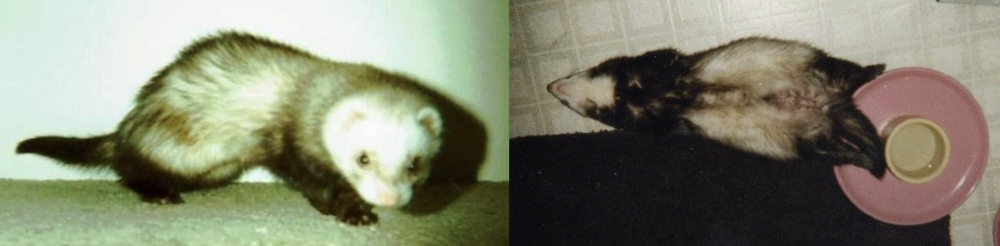
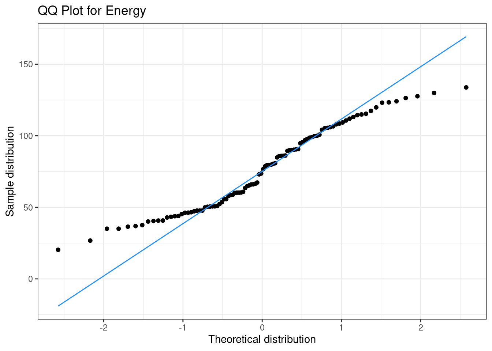
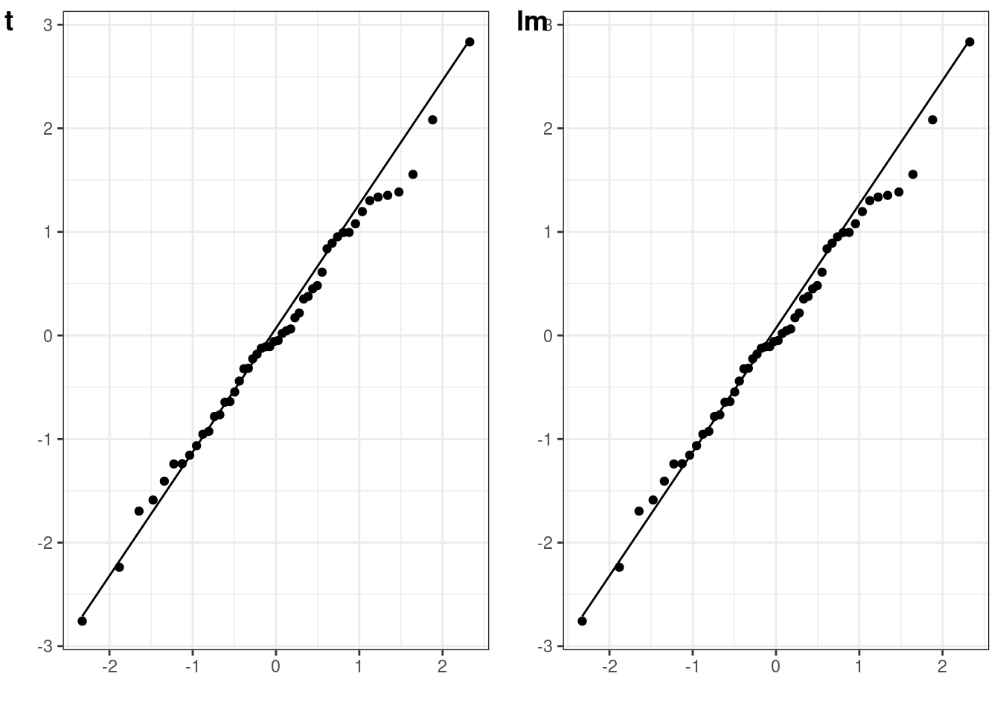
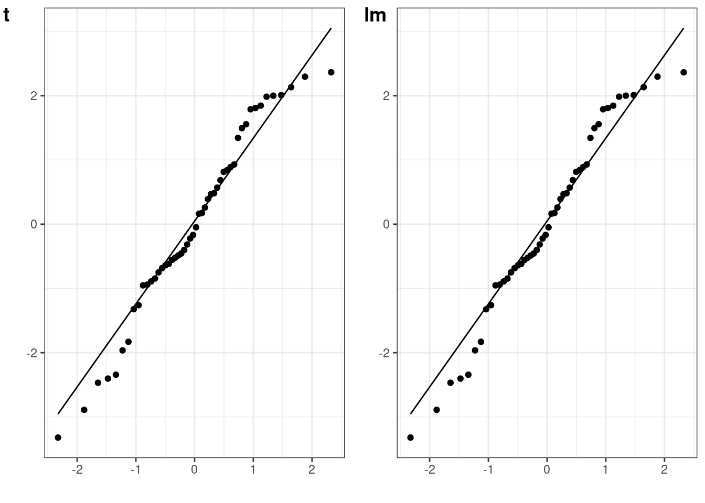

# Testing for normality

- Lisa DeBruine (2021-02-01)


You've probably been directed here because you asked someone about how to test the normality of predictors in an analysis. However, statistical tests like t-tests, ANOVAs, and other <a class='glossary' target='_blank' title='A mathematical model comparing how one or more independent variables affect a continuous dependent variable' href='https://psyteachr.github.io/glossary/g#general-linear-model'>GLM</a>-based tests assume that the <a class='glossary' target='_blank' title='Defined as the deviation of an observation from a model&#39;s expected value.' href='https://psyteachr.github.io/glossary/r#residual'>residuals</a> will be normally distributed and it doesn't matter at all if the <a class='glossary' target='_blank' title='A variable whose value is used (in a model) to predict the value of a response variable.' href='https://psyteachr.github.io/glossary/p#predictor-variable'>predictors</a> and even the <a class='glossary' target='_blank' title='The target variable that is being analyzed, whose value is assumed to depend on other variables.' href='https://psyteachr.github.io/glossary/d#dependent-variable'>dependent variable</a> aren't.


```r
library(tidyverse) # for data wrangling
library(faux)      # for data simulation
library(afex)      # for anova
library(cowplot)   # for dataviz
set.seed(8675309)  # to make sure simulation values don't vary between runs
```

In this blog post, I'm going to use data simulation to show you how you can visualise the normality of residuals with <a class='glossary' target='_blank' title='A scatterplot created by plotting two sets of quantiles against each other, used to check if data come from a specified distribution' href='https://psyteachr.github.io/glossary/q#q-q-plot'>QQ plots</a>. We're going to simulate data from a totally hypothetical population of ferrets and cats. We're going to try to predict the energy levels of these pets from their weight. In my limited experience, tiny ferrets are way more energetic than big ferrets. I know nothing about cats.



## Simulate Data

We'll use [faux](https://debruine.github.io/faux/) to simulate data based on data parameters like means, SDs and correlations for each group. At the moment, faux can only simulate multivariate normal distributions and then you can convert them to other distributions. So we'll simulate weights from a <a class='glossary' target='_blank' title='A symmetric distribution of data where values near the centre are most probable.' href='https://psyteachr.github.io/glossary/n#normal-distribution'>normal distribution</a> with a mean of 0 and SD of 1, and then convert these to a <a class='glossary' target='_blank' title='A distribution where all numbers in the range have an equal probability of being sampled' href='https://psyteachr.github.io/glossary/u#uniform-distribution'>uniform distribution</a> for each pet type based on ranges I found online. Energy will be simulated from normal distributions with different means and SDs for cats and ferrets. Energy will be uncorrelated with weight for cats and negatively correlated for ferrets.


```r
data <- faux::sim_design(
  within = list(vars = c("weight", "energy")),
  between = list(species = c("cat", "ferret")),
  n = 50,
  mu = list(weight = c(cat = 0, ferret = 0),
            energy = c(cat = 50, energy = 100)),
  sd = list(weight = c(cat = 1, ferret = 1),
            energy = c(cat = 15, energy = 20)),
  r = list(cat = 0, ferret = -0.5),
  plot = FALSE
) %>%
  mutate(weight = case_when(
    species == "cat" ~ norm2unif(weight, 3.6, 4.5),
    species == "ferret" ~ norm2unif(weight, 0.7, 2.0)
  ))
```

N.B. If you're more used to [simulating data using model parameters](https://debruine.github.io/tutorials/sim-data.html#intercept-model), this way might make more sense to you, but it's often difficult to figure out what the <a class='glossary' target='_blank' title='A quantity characterizing a population.' href='https://psyteachr.github.io/glossary/p#parameter'>parameters</a> should be if you don't already have pilot data.


```r
n <- 50

# values approximated from an lm analysis
b_0  <-  92 # intercept
b_w  <- -13 # fixed effect of weight
b_s  <-  85 # fixed effect of species
b_ws <- -26 # weight*species interaction
err_sd <- 16 # SD of error term

# simulate populations of cats and ferrets 
# with weights from uniform distributions
cat <- data.frame(
  id = paste0("C", 1:n),
  species = "cat",
  weight = runif(n, 3.6, 4.5)
)

ferret <- data.frame(
  id = paste0("F", 1:n),
  species = "ferret",
  weight = runif(n, 0.7, 2.0)
)

# join data and calculate DV based on GLM
data <- bind_rows(cat, ferret) %>%
  mutate(
    # effect-code species
    species.e = recode(species, cat = -0.5, ferret = 0.5),
    # simulate error term
    err = rnorm(2*n, 0, err_sd),
    # calculate DV
    energy = b_0 + species.e*b_s + weight*b_w + 
             species.e*weight*b_ws + err
  )
```


So weight is bimodal and made of two uniform distributions, while energy is bimodal and made of two normal distributions.

<div class="figure" style="text-align: center">

<p class="caption">(\#fig:unnamed-chunk-4)Distibutions overall and within species.</p>
</div>

If you run a Shapiro-Wilk test on these variables, you'd conclude they are *definitely* not normally distributed, but this doesn't matter at all!


```r
shapiro.test(data$energy)
```

```
## 
## 	Shapiro-Wilk normality test
## 
## data:  data$energy
## W = 0.95486, p-value = 0.001759
```


```r
shapiro.test(data$weight)
```

```
## 
## 	Shapiro-Wilk normality test
## 
## data:  data$weight
## W = 0.82694, p-value = 1.821e-09
```


## Calculate Residuals

We will predict energy from weight, species, and their interaction using a <a class='glossary' target='_blank' title='A mathematical model comparing how one or more independent variables affect a continuous dependent variable' href='https://psyteachr.github.io/glossary/g#general-linear-model'>linear model</a>. We'll <a class='glossary' target='_blank' title='A coding scheme for categorical variables that contrasts each group mean with the mean of all the group means.' href='https://psyteachr.github.io/glossary/e#effect-code'>effect code</a> species to make the output more similar to what you'd get from ANOVA (and it doesn't really make sense to <a class='glossary' target='_blank' title='A coding scheme for categorical variables that creates (n_levels -1) dichotomous variables where each level of the categorical variable is contrasted to a reference level.' href='https://psyteachr.github.io/glossary/t#treatment-code'>treatment code</a> them, since neither cats nor ferrets are a meaningful "baseline").


```r
# effect-code species
data$species.e <- recode(data$species, cat = -0.5, ferret = 0.5)

m1 <- lm(energy ~ weight*species.e, data = data)
```

<table>
 <thead>
  <tr>
   <th style="text-align:left;"> term </th>
   <th style="text-align:right;"> estimate </th>
   <th style="text-align:right;"> std.error </th>
   <th style="text-align:right;"> statistic </th>
   <th style="text-align:right;"> p.value </th>
  </tr>
 </thead>
<tbody>
  <tr>
   <td style="text-align:left;"> (Intercept) </td>
   <td style="text-align:right;"> 85.414 </td>
   <td style="text-align:right;"> 16.204 </td>
   <td style="text-align:right;"> 5.271 </td>
   <td style="text-align:right;"> 0.000 </td>
  </tr>
  <tr>
   <td style="text-align:left;"> weight </td>
   <td style="text-align:right;"> -7.928 </td>
   <td style="text-align:right;"> 4.674 </td>
   <td style="text-align:right;"> -1.696 </td>
   <td style="text-align:right;"> 0.093 </td>
  </tr>
  <tr>
   <td style="text-align:left;"> species.e </td>
   <td style="text-align:right;"> 76.821 </td>
   <td style="text-align:right;"> 32.407 </td>
   <td style="text-align:right;"> 2.370 </td>
   <td style="text-align:right;"> 0.020 </td>
  </tr>
  <tr>
   <td style="text-align:left;"> weight:species.e </td>
   <td style="text-align:right;"> -18.107 </td>
   <td style="text-align:right;"> 9.348 </td>
   <td style="text-align:right;"> -1.937 </td>
   <td style="text-align:right;"> 0.056 </td>
  </tr>
</tbody>
</table>


You can use the `resid()` function to get the <a class='glossary' target='_blank' title='' href='https://psyteachr.github.io/glossary/r#residuals'>residual error</a> term from your model. This is the difference between the predicted value (based on the weight and species for each subject and the model parameters) and the actual value. Those values should be normally distributed.


```r
err <- resid(m1)

ggplot() + geom_density(aes(err))
```


## Shapiro-Wilk

I don't recommend using statistical tests for normality. Essentially, they are underpowered in small samples and overpowered in large samples. [Robert Greener has a good discussion of this.](https://towardsdatascience.com/stop-testing-for-normality-dba96bb73f90). However, the residuals do "pass" the Shapiro-Wilk normality test.


```r
shapiro.test(err)
```

```
## 
## 	Shapiro-Wilk normality test
## 
## data:  err
## W = 0.99579, p-value = 0.9905
```


## QQ plots

It's better to assess normality visually, but it's quite hard to judge normality from a density plot, especially when you have small samples, so we can use a <a class='glossary' target='_blank' title='A scatterplot created by plotting two sets of quantiles against each other, used to check if data come from a specified distribution' href='https://psyteachr.github.io/glossary/q#q-q-plot'>QQ plot</a> to visualise how close a distribution is to normal. This is a scatterplot created by plotting two sets of <a class='glossary' target='_blank' title='Cutoffs dividing the range of a distribution into continuous intervals with equal probabilities.' href='https://psyteachr.github.io/glossary/q#quantile'>quantiles</a> against each other, used to check if data come from a specified distribution (here the normal distribution).

These data are simulated, so will show an almost perfect straight line. Real data are always a bit messier. But even here, the points at the extremes are often not exactly on the line. It takes practice to tell if a QQ-plot shows clear signs of non-normality.


```r
# ggplot function for more customisation
qplot(sample = err) + 
  stat_qq_line(colour = "dodgerblue") +
  labs(x = "Theoretical distribution",
       y = "Sample distribution",
       title = "QQ Plot for Residual Error")
```


Our bimodal energy data are a good example of a QQ plot showing a non-normal distribution (see how the points move away from the line at the ends), but that doesn't matter for your model at all.


```r
ggplot(data, aes(sample = energy)) +
  stat_qq() +
  stat_qq_line(colour = "dodgerblue") +
  labs(x = "Theoretical distribution",
       y = "Sample distribution",
       title = "QQ Plot for Energy")
```




## Other tests

So how do you get the residuals for other tests? All functions that return models in R should have a `resid()` function. T-tests are a little trickier, but you can just convert them to their GLM equivalents ([Jonas Lindeløv has a great tutorial](https://lindeloev.github.io/tests-as-linear/)) or use the formulas below.


```r
# simulated data to use below
A <- rnorm(50, 0, 1)
B <- rnorm(50, 0.5, 1)
```

### One-sample t-test

The residuals for a one-samples t-test are the scores minus the mean difference. (You don't *have to* subtract the mean difference, since the distribution won't change if you add a constant value.)


```r
# one-sample t-test against 0
mu = 0
t_o <- t.test(A, mu = mu)
err_t <- A - mean(A)
plot_t <- qplot(sample = err_t) + stat_qq_line()

# lm equivalent to one-sample t-test
m_o <- lm(A - mu ~ 1)
err_lm <- resid(m_o)
plot_lm <- qplot(sample = err_lm) + stat_qq_line()

cowplot::plot_grid(plot_t, plot_lm, labels = c("t", "lm"))
```



### Paired samples t-test

The residuals for a paired-samples t-test are the difference between the paired values, minus the mean difference.


```r
# paired samples t-test
t_p <- t.test(A, B, paired = TRUE)
diff <- A - B
err_t <- diff - mean(diff)
plot_t <- qplot(sample = err_t) + stat_qq_line()

# lm equivalent to paired-samples t-test
m_p <- lm(A-B ~ 1)
err_lm <- resid(m_p)
plot_lm <- qplot(sample = err_lm) + stat_qq_line()

cowplot::plot_grid(plot_t, plot_lm, labels = c("t", "lm"))
```



### Independent-samples t-test

The residuals for an independent-samples t-test are the scores minus their own group mean.


```r
# independent-sample t-test
t_i <- t.test(A, B)
err_t <- c(A-mean(A), B-mean(B))
plot_t <- qplot(sample = err_t) + stat_qq_line()

# lm equivalent to one-sample t-test
dat <- data.frame(
  val = c(A, B),
  grp = rep(0:1, each = 50)
)

m_o <- lm(val ~ 1 + grp, dat)
err_lm <- resid(m_o)
plot_lm <- qplot(sample = err_lm) + stat_qq_line()

cowplot::plot_grid(plot_t, plot_lm, labels = c("t", "lm"))
```


### ANOVA

You can use the `resid()` function on the models output by ANOVAs or ANCOVAs.


```r
m_aov <- afex::aov_4(energy ~ weight*species.e + (1|id),
  data = data,
  factorize = FALSE
)
plot_aov <- qplot(sample = resid(m_aov)) + stat_qq_line()

m_lm <- lm(energy ~ weight*species.e, data = data)
plot_lm <- qplot(sample = resid(m_lm)) + stat_qq_line()

cowplot::plot_grid(plot_aov, plot_lm, labels = c("aov", "lm"))
```


Dale Barr has a great blog post on [checking assumptions for multilevel data](https://datahowler.wordpress.com/2018/08/04/checking-model-assumptions-look-at-the-residuals-not-the-raw-data/).

## Glossary

<table class="table" style="margin-left: auto; margin-right: auto;">
 <thead>
  <tr>
   <th style="text-align:left;"> term </th>
   <th style="text-align:left;"> definition </th>
  </tr>
 </thead>
<tbody>
  <tr>
   <td style="text-align:left;"> [dependent variable](https://psyteachr.github.io/glossary/d.html#dependent-variable){class="glossary" target="_blank"} </td>
   <td style="text-align:left;"> The target variable that is being analyzed, whose value is assumed to depend on other variables. </td>
  </tr>
  <tr>
   <td style="text-align:left;"> [effect code](https://psyteachr.github.io/glossary/e.html#effect-code){class="glossary" target="_blank"} </td>
   <td style="text-align:left;"> A coding scheme for categorical variables that contrasts each group mean with the mean of all the group means. </td>
  </tr>
  <tr>
   <td style="text-align:left;"> [general linear model](https://psyteachr.github.io/glossary/g.html#general-linear-model){class="glossary" target="_blank"} </td>
   <td style="text-align:left;"> A mathematical model comparing how one or more independent variables affect a continuous dependent variable </td>
  </tr>
  <tr>
   <td style="text-align:left;"> [normal distribution](https://psyteachr.github.io/glossary/n.html#normal-distribution){class="glossary" target="_blank"} </td>
   <td style="text-align:left;"> A symmetric distribution of data where values near the centre are most probable. </td>
  </tr>
  <tr>
   <td style="text-align:left;"> [parameter](https://psyteachr.github.io/glossary/p.html#parameter){class="glossary" target="_blank"} </td>
   <td style="text-align:left;"> A quantity characterizing a population. </td>
  </tr>
  <tr>
   <td style="text-align:left;"> [predictor variable](https://psyteachr.github.io/glossary/p.html#predictor-variable){class="glossary" target="_blank"} </td>
   <td style="text-align:left;"> A variable whose value is used (in a model) to predict the value of a response variable. </td>
  </tr>
  <tr>
   <td style="text-align:left;"> [q q plot](https://psyteachr.github.io/glossary/q.html#q-q-plot){class="glossary" target="_blank"} </td>
   <td style="text-align:left;"> A scatterplot created by plotting two sets of quantiles against each other, used to check if data come from a specified distribution </td>
  </tr>
  <tr>
   <td style="text-align:left;"> [quantile](https://psyteachr.github.io/glossary/q.html#quantile){class="glossary" target="_blank"} </td>
   <td style="text-align:left;"> Cutoffs dividing the range of a distribution into continuous intervals with equal probabilities. </td>
  </tr>
  <tr>
   <td style="text-align:left;"> [residual](https://psyteachr.github.io/glossary/r.html#residual){class="glossary" target="_blank"} </td>
   <td style="text-align:left;"> Defined as the deviation of an observation from a model's expected value. </td>
  </tr>
  <tr>
   <td style="text-align:left;"> [residuals](https://psyteachr.github.io/glossary/r.html#residuals){class="glossary" target="_blank"} </td>
   <td style="text-align:left;">  </td>
  </tr>
  <tr>
   <td style="text-align:left;"> [treatment code](https://psyteachr.github.io/glossary/t.html#treatment-code){class="glossary" target="_blank"} </td>
   <td style="text-align:left;"> A coding scheme for categorical variables that creates (n_levels -1) dichotomous variables where each level of the categorical variable is contrasted to a reference level. </td>
  </tr>
  <tr>
   <td style="text-align:left;"> [uniform distribution](https://psyteachr.github.io/glossary/u.html#uniform-distribution){class="glossary" target="_blank"} </td>
   <td style="text-align:left;"> A distribution where all numbers in the range have an equal probability of being sampled </td>
  </tr>
</tbody>
</table>


